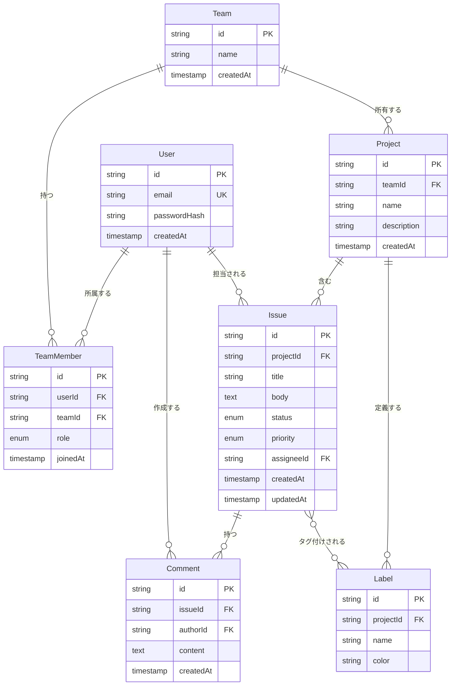

# Issues Tracker API

フルスタックの課題管理システムです。
このプロジェクトは、エンドツーエンドのAPI設計、認証・認可パターン、マルチテナント対応のプロジェクト管理のためのデータベースアーキテクチャを実証します。

## 概要

Issues Tracker APIは、GitHub IssuesおよびProjectsのシンプル版クローンであり、以下の機能を備えています：

- マルチユーザー認証 - JWTベースのセッション管理
- チームベースのアクセス制御 - オーナーとメンバーのロール管理
- プロジェクトと課題の管理 - ステータス追跡、ラベル、コメント機能
- RESTful API設計 - 業界標準のベストプラクティスに準拠
- 型安全なデータベース操作 - Prisma ORMによる実装

このプロジェクトは、機能の完全性よりもアーキテクチャの明瞭性と設計判断の文書化を優先しており、ポートフォリオのデモンストレーションや技術的な議論に適しています。

## 技術スタック

| カテゴリ       | 技術                   | 選定理由                                                 |
| -------------- | ---------------------- | -------------------------------------------------------- |
| ランタイム     | Node.js + TypeScript   | 型安全性とモダンなJavaScriptエコシステム                 |
| フレームワーク | Express                | ミドルウェアチェーンとリクエストライフサイクルを直接制御 |
| ORM            | Prisma                 | 型安全なクエリ、直感的なAPI、マイグレーション管理        |
| データベース   | PostgreSQL             | 強い一貫性を持つプロダクショングレードのRDB              |
| バリデーション | Zod                    | TypeScript型推論を伴うランタイム型検証                   |
| 認証           | JWT + bcrypt           | ステートレス認証と安全なパスワードハッシュ化             |
| テスト         | Vitest + Supertest     | 高速なテスト実行とHTTPアサーションライブラリ             |
| フロントエンド | React + TanStack Query | サーバー同期を伴うモダンな状態管理                       |
| インフラ       | Docker Compose         | 再現可能な開発環境                                       |

## ドメインモデル



## APIエンドポイント

### 認証

| メソッド | エンドポイント     | 説明                       | 認証要否 |
| -------- | ------------------ | -------------------------- | -------- |
| POST     | `/api/auth/signup` | 新規ユーザーアカウント作成 | 不要     |
| POST     | `/api/auth/login`  | 認証してJWTを取得          | 不要     |

### チーム

| メソッド | エンドポイント                   | 説明                                   | 認証要否 |
| -------- | -------------------------------- | -------------------------------------- | -------- |
| POST     | `/api/teams`                     | 新しいチームを作成                     | 必要     |
| GET      | `/api/teams`                     | ユーザーが所属するチーム一覧           | 必要     |
| POST     | `/api/teams/:id/members`         | チームにメンバーを招待（オーナーのみ） | 必要     |
| DELETE   | `/api/teams/:id/members/:userId` | チームメンバーを削除（オーナーのみ）   | 必要     |

### プロジェクト

| メソッド | エンドポイント                | 説明                       | 認証要否 |
| -------- | ----------------------------- | -------------------------- | -------- |
| POST     | `/api/teams/:teamId/projects` | チーム内にプロジェクト作成 | 必要     |
| GET      | `/api/teams/:teamId/projects` | チームのプロジェクト一覧   | 必要     |

### 課題（Issue）

| メソッド | エンドポイント                             | 説明                                       | 認証要否 |
| -------- | ------------------------------------------ | ------------------------------------------ | -------- |
| POST     | `/api/projects/:projectId/issues`          | 新しい課題を作成                           | 必要     |
| GET      | `/api/projects/:projectId/issues`          | 課題一覧（フィルタ、ページネーション対応） | 必要     |
| GET      | `/api/projects/:projectId/issues/:issueId` | 課題詳細を取得                             | 必要     |
| PATCH    | `/api/projects/:projectId/issues/:issueId` | 課題を更新                                 | 必要     |
| DELETE   | `/api/projects/:projectId/issues/:issueId` | 課題を削除                                 | 必要     |

### コメント

| メソッド | エンドポイント                  | 説明                         | 認証要否 |
| -------- | ------------------------------- | ---------------------------- | -------- |
| POST     | `/api/issues/:issueId/comments` | 課題にコメントを追加         | 必要     |
| GET      | `/api/issues/:issueId/comments` | 課題のコメント一覧           | 必要     |
| DELETE   | `/api/comments/:commentId`      | コメントを削除（作成者のみ） | 必要     |

### ラベル

| メソッド | エンドポイント                    | 説明               | 認証要否 |
| -------- | --------------------------------- | ------------------ | -------- |
| POST     | `/api/projects/:projectId/labels` | ラベルを作成       | 必要     |
| PUT      | `/api/issues/:issueId/labels`     | 課題のラベルを更新 | 必要     |

## アーキテクチャ

プロジェクトはレイヤードアーキテクチャパターンに従っています：

```
┌─────────────────────────────────────────┐
│       HTTPレイヤー（Express）            │
│  ┌─────────────────────────────────┐   │
│  │   Routes → Controllers          │   │
│  └─────────────────────────────────┘   │
└─────────────────┬───────────────────────┘
                  │
┌─────────────────▼───────────────────────┐
│       ビジネスロジックレイヤー            │
│  ┌─────────────────────────────────┐   │
│  │   Services（ドメインロジック）    │   │
│  └─────────────────────────────────┘   │
└─────────────────┬───────────────────────┘
                  │
┌─────────────────▼───────────────────────┐
│       データアクセスレイヤー              │
│  ┌─────────────────────────────────┐   │
│  │   Prisma ORM → PostgreSQL       │   │
│  └─────────────────────────────────┘   │
└─────────────────────────────────────────┘

        横断的関心事:
    ┌────────────────────────────┐
    │  • 認証ミドルウェア          │
    │  • 認可ミドルウェア          │
    │  • エラーハンドリングミドルウェア│
    │  • リクエストログ           │
    └────────────────────────────┘
```

### 設計原則

1. 関心の分離: ControllerはHTTP入出力を処理、Serviceはビジネスロジックを含む
2. 依存の方向: HTTPレイヤーはビジネスロジックに依存、逆は決してない
3. エラーハンドリング: カスタムエラークラスがビジネス例外とHTTPステータスコードを橋渡し
4. 型安全性: APIリクエストからデータベースクエリまでのエンドツーエンドの型安全性
5. テスタビリティ: Serviceレイヤーは、HTTPインフラから独立してテスト可能

## エラーハンドリング

APIは統一されたエラーレスポンス形式を使用します：

```json
{
  "error": {
    "code": "VALIDATION_ERROR",
    "message": "Invalid email format",
    "details": {
      "field": "email",
      "issue": "Invalid email"
    }
  }
}
```

### HTTPステータスコード

| ステータス | 用途                                                    |
| ---------- | ------------------------------------------------------- |
| 400        | Bad Request - リクエスト構文が不正                      |
| 401        | Unauthorized - 認証トークンが欠落または無効             |
| 403        | Forbidden - 認証済みだが権限不足                        |
| 404        | Not Found - リソースが存在しない                        |
| 409        | Conflict - リソースが既に存在（例：メールアドレス重複） |
| 422        | Unprocessable Entity - バリデーションエラー             |
| 500        | Internal Server Error - 予期しないサーバーエラー        |

## セキュリティ機能

- パスワードハッシュ化: bcryptによる自動ソルト生成
- JWT認証: 設定可能な有効期限を持つステートレストークンベース認証
- ロールベースアクセス制御: チームレベルの権限（オーナー/メンバー）
- リソース所有権: ユーザーは自分のコメントと課題のみ変更可能
- 入力バリデーション: Zodスキーマによる全入力データの検証
- SQLインジェクション対策: Prisma ORMによるパラメータ化クエリ

## セットアップ

### 必要な環境

- Node.js 18以上 および npm
- Docker および Docker Compose
- PostgreSQL 14以上（またはDockerを使用）

### インストール

```bash
# リポジトリをクローン
git clone https://github.com/yourusername/issues-tracker-api.git
cd issues-tracker-api

# バックエンドの依存関係をインストール
cd backend
npm install

# 環境変数を設定
cp .env.example .env
# .envファイルを編集して設定を記入

# データベースマイグレーションを実行
npx prisma migrate dev

# 開発サーバーを起動
npm run dev
```

### Docker Composeを使用する場合

```bash
# 全サービスを起動（PostgreSQL + API + Frontend）
docker compose up --build

# APIは http://localhost:3000 で利用可能
# フロントエンドは http://localhost:5173 で利用可能
```

### テストの実行

```bash
cd backend
npm test                    # 全テストを実行
npm test -- auth.test.ts    # 特定のテストファイルを実行
```
